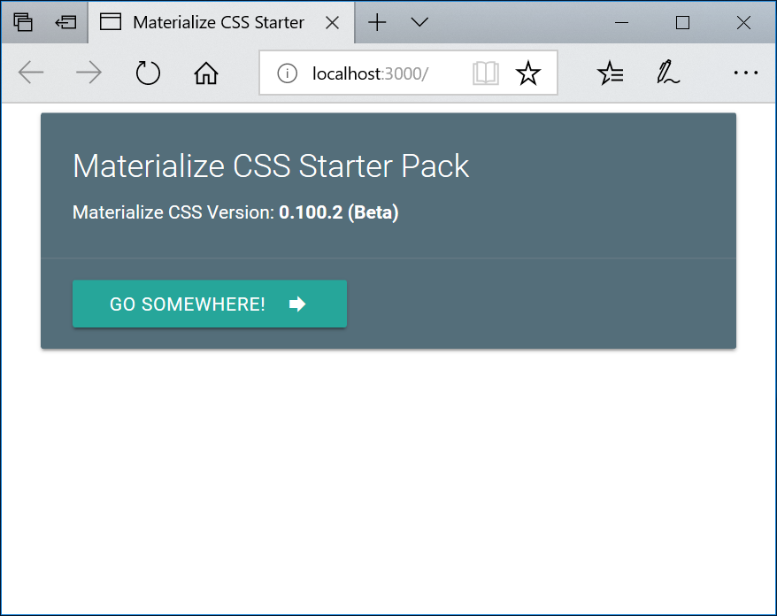

# **mcssstarter** - Materialize CSS Starter Pack *(For Materialize CSS Version 0.100.2 - Beta)*

**Version:** 1.0.0



## Overview:
This *Starter Pack* is a starting point for building a Web front-end with the **Materialize CSS** UI framework (http://materializecss.com/). It implements an automated *Gulp* development workflow (https://gulpjs.com/).

This *Starter Pack* is based on the *Bootstrap 4 Starter Pack*, published by **Brad Traversy** (*Traversy Media*) (https://github.com/bradtraversy/bs4starter). Brad has produced a comprehensive Materialize CSS course, available online at **Udemy** (*Thumbs Up!*) (https://www.udemy.com/materialize-css-from-scratch-with-5-projects/learn/v4/content).

## Requirements:

1. **NPM** (Node Package Manager): Part of the *NodeJS* installation - https://nodejs.org/en/

2. **Gulp CLI**: Javascript Task Runner - *installed using NPM* - https://gulpjs.com/

## Usage:

1. Download Zip File or Clone the Repository

2. Download/Install the project dependencies:
```
$ npm install
```

3. Start the development Server and see HTML/JS/Sass changes reflected in the attached browsers, in real-time (via **BrowserSync** - https://browsersync.io/):
```
$ npm start
```
